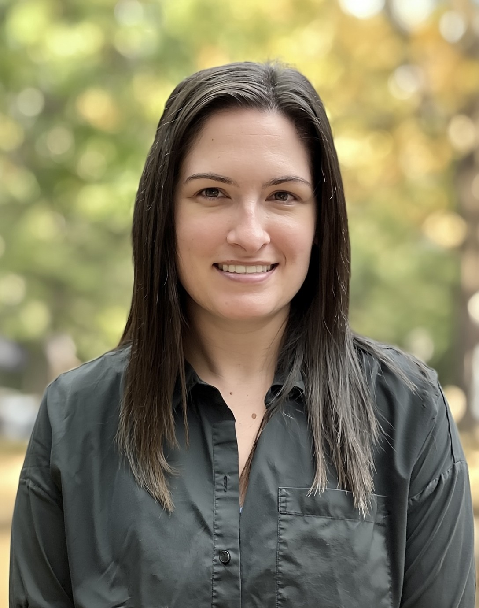
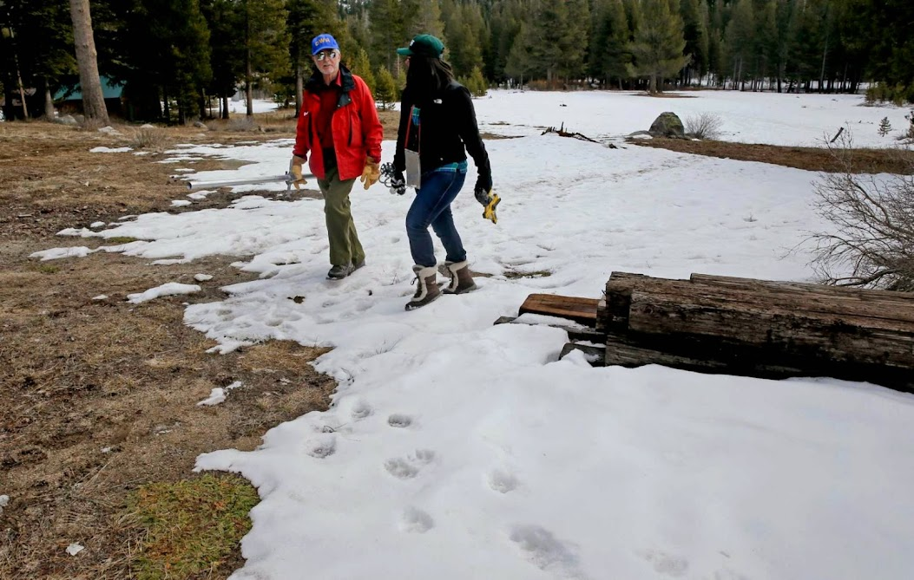
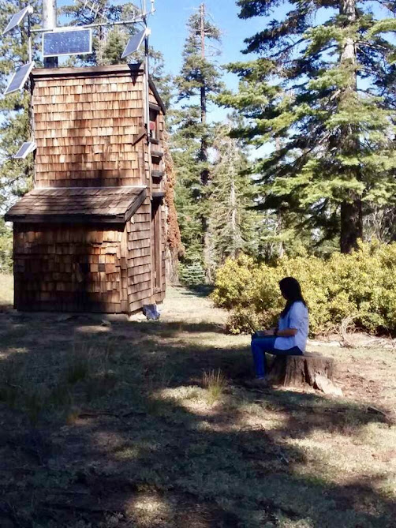
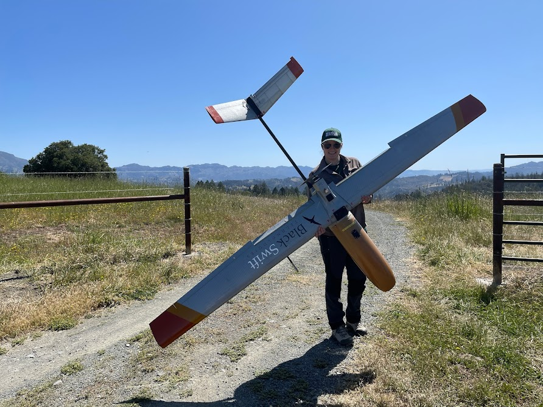
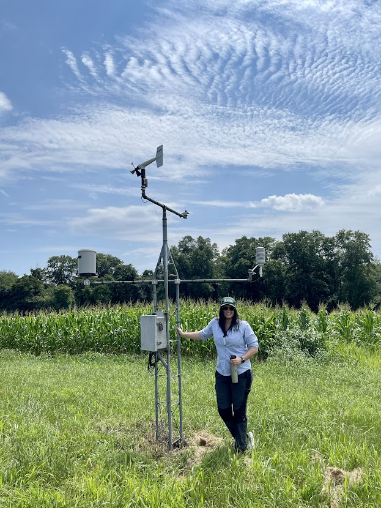
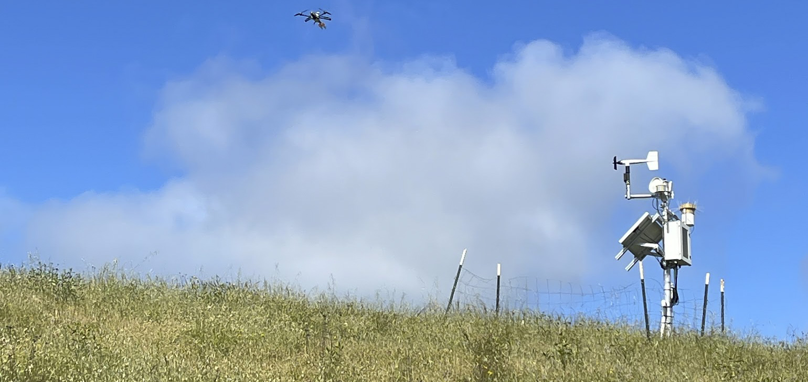

{width=90 alt="Michelle Stern headshot"}{width=180 alt="Walking on snow"}{width=85 alt="At a monitoring station"}{width=152 alt="Holding a drone"}{width=85 alt="Soil moisture station"} 

**Michelle Stern, PhD**  
Senior Environmental Scientist, Delta Science Program — Delta Stewardship Council  
ORCID: [0000-0003-3030-7065](https://orcid.org/0000-0003-3030-7065)

[Google Scholar](https://scholar.google.com/citations?user=XYN5od0AAAAJ&hl=en) • [ResearchGate](https://www.researchgate.net/profile/Michelle-Stern) • [GitHub](https://github.com/michelleastern)

---

## Short bio

I study how changes in climate, wildfires, and land use affect water, soil, and water quality in California and the western United States. My work combines field observations, satellite data, and models to better understand water quantity and quality. My work supports resource management in the Sacramento San Joaquin Bay-Delta through open and transparent model and data practices, model development, and translating science through maps, synthesis, and other products. My current priority is to advance collaborative modeling through the Delta Modeling Collaboratory.

---

## Research keywords

hydrology • sediment transport • soil moisture • post-fire runoff • remote sensing • climate change • watershed modeling • open data • harmful algal blooms • GIS

---

## Selected projects

- [Cyanobacterial Harmful Algal Bloom (CHABs) NCEAS Synthesis](https://delta-stewardship-council.github.io/swg-26-chab/) 
- Soil moisture monitoring in the [Upper Feather River watershed](https://ca.water.usgs.gov/upper-feather-river-watershed/)
- [Climate and hydrology explorer](https://ca.water.usgs.gov/projects/cdfw-climate-hydrology-explorer) for CDFW Sentinel sites
- [BCMv8: Basin Characterization Model, 1896-present](https://www.sciencebase.gov/catalog/item/5f29c62d82cef313ed9edb39) and [CMIP5 future scenarios](https://www.sciencebase.gov/catalog/item/61e069f3d34e8911d9fe9dba) for California hydrology 
- [Feather River 30-m BCMv8](https://www.sciencebase.gov/catalog/item/686f08f2d4be020e5c01cbbe) 

---

## Selected publications

1. Stern, M.; Flint, L.; Minear, J.; Flint, A.; Wright, S. (2016). "Characterizing changes in streamflow and sediment supply in the Sacramento River Basin, California, using hydrological simulation program—FORTRAN (HSPF)." *Water*, 8(10):432.  
   [https://www.mdpi.com/2073-4441/8/10/432](https://www.mdpi.com/2073-4441/8/10/432)  

   Uses hydrologic modeling to document trends in streamflow and suspended-sediment supply across the Sacramento River Basin useful for watershed and Delta planning.

2. Stern, M. A.; Flint, L. E.; Flint, A. L.; Knowles, N.; Wright, S. A. (2020). "The future of sediment transport and streamflow under a changing climate and the implications for long‑term resilience of the San Francisco Bay‑Delta." *Water Resources Research*: e2019WR026245.  
   [https://doi.org/10.1029/2019WR026245](https://doi.org/10.1029/2019WR026245)
   
   Projects how climate-driven changes in streamflow and sediment will affect the Bay‑Delta system and discusses implications for long‑term resilience planning.

3. Flint, L. E.; Flint, A. L.; Stern, M. A. (2021). "The Basin Characterization Model—A Monthly Regional Water balance software package." USGS Techniques and Methods 6-H1.  
    [https://doi.org/10.3133/tm6H1](https://doi.org/10.3133/tm6H1)

    Publicly available model documentation for the Basin Characterization Model (BCMv8) used to produce historical and future monthly climate and hydrology datasets across California.

4. Baalousha, M.; Desmau, M.; Singerling, S. A.; Webster, J. P.; Matiasek, S. J.; Stern, M. A.; Alpers, C. N. (2022). "Discovery and potential ramifications of reduced iron‑bearing nanoparticles—magnetite, wüstite, and zero‑valent iron—in wildland–urban interface fire ashes." *Environmental Science: Nano*, 9(11):4136–4149.  
   [https://doi.org/10.1039/d2en00248b](https://doi.org/10.1039/d2en00248b)  

   Identifies iron‑bearing nanoparticles in wildfire ash and evaluates potential environmental and health implications after fires.

5. Curtis, J. A.; Flint, L. E.; Stern, M. A. (2019). "A Multi‑Scale Soil Moisture Monitoring Strategy for California: Design and Validation." *JAWRA Journal of the American Water Resources Association*, 55(3):740–758.  
   [https://doi.org/10.1111/1752-1688.12736](https://doi.org/10.1111/1752-1688.12736)  
   
   Describes a multi‑scale monitoring design and validation approach to improve soil moisture observations that support water‑resource and drought monitoring.

6. Stern, M. A.; Flint, L. E.; Flint, A. L.; Christensen, A. H. (2021). "A Basin‑Scale Approach to Estimating Recharge in the Desert: Anza‑Cahuilla Groundwater Basin, CA." *JAWRA Journal of the American Water Resources Association*, 57(6):990–1003.  
   [https://doi.org/10.1111/1752-1688.12939](https://doi.org/10.1111/1752-1688.12939)  
   
   Presents a basin‑scale method to estimate groundwater recharge in arid/desert basins to inform groundwater management decisions.

7. Curtis, J. A.; Flint, L. E.; Stern, M. A.; Lewis, J.; Klein, R. D. (2021). "Amplified Impact of Climate Change on Fine‑Sediment Delivery to a Subsiding Coast, Humboldt Bay, California." *Estuaries and Coasts*, 44(8):2173–2193.  
   [https://doi.org/10.1007/s12237-021-00992-x](https://doi.org/10.1007/s12237-021-00992-x)  
   
   Shows how climate change increases fine‑sediment delivery to subsiding coastal bays, with implications for coastal resilience and habitat.

8. Stern, M. A.; Flint, L. E.; Flint, A. L.; Boynton, R. M.; Stewart, J. A. E.; Wright, J. W.; Thorne, J. H. (2022). "Selecting the optimal fine‑scale historical climate data for assessing current and future hydrological conditions." *Journal of Hydrometeorology*, 23(3):293–308.  
   [https://doi.org/10.1175/JHM-D-21-0121.1](https://doi.org/10.1175/JHM-D-21-0121.1)  
   
   Evaluates historical climate datasets to identify the best options for hydrologic assessments under current and future climates.

9. Stern, M.; Ferrell, R.; Flint, L.; Kozanitas, M.; Ackerly, D.; Elston, J.; Stachura, M.; Dai, E.; Thorne, J. (2024). "Fine‑scale surficial soil moisture mapping using UAS‑based L‑band remote sensing in a mixed oak‑grassland landscape." *Frontiers in Remote Sensing*, 5:1337953.  
   [https://doi.org/10.3389/frsen.2024.1337953](https://doi.org/10.3389/frsen.2024.1337953)  
   
   Demonstrates how an unoccupied aircraft system (UAS) L‑band radiometer can map soil moisture at fine scales to support fire‑risk and ecological monitoring.

10. Wang, J.; Stern, M. A.; King, V. M.; Alpers, C. N.; Quinn, N. W. T.; Flint, A. L.; Flint, L. E. (2020). "PFHydro: A New Watershed-Scale Model for Post-Fire Runoff Simulation." *Environmental Modelling & Software*, 123:104555.  
   [https://doi.org/10.1016/j.envsoft.2019.104555](https://doi.org/10.1016/j.envsoft.2019.104555)  
   
      Introduces PFHydro, a watershed model that predicts how wildfire changes runoff and sediment delivery so managers can better plan post-fire flood and erosion responses.

---

## Teaching & mentoring

- Guest lectures and short courses on hydrologic modeling, soil moisture monitoring, and post‑fire hydrology.  
- Supervises and collaborates with graduate and undergraduate students on applied watershed and remote‑sensing projects.

---

## Data & code

I am committed to open data and modeling practices. Most of my data releases and model archives are available through USGS data releases and institutional repositories (see publications for dataset DOIs). If you need a specific dataset or model archive, contact me.

---

## Contact

- [michelle.stern@deltacouncil](michelle.stern@deltacouncil.ca.gov) 
- Delta Science Program, Delta Stewardship Council  

<figure class="banner-figure" aria-label="Monitoring site and a drone flying overhead">
  
</figure>
